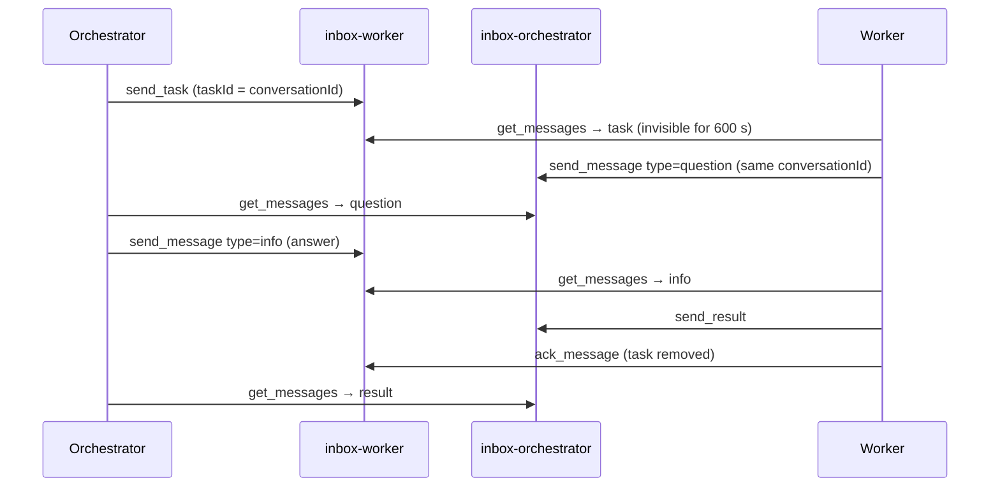

# AgentQueueMcp

> **Firewall-friendly messaging for AI agents.** One Azure Storage account becomes an addressed,
> multi-agent message bus — pull-only, zero inbound ports, zero servers to host, costs pennies.

[](https://github.com/smollini/AgentQueueMcp/actions/workflows/ci.yml)
[](LICENSE)
[](https://dotnet.microsoft.com/)
[](https://github.com/smollini/AgentQueueMcp/tags)
[](https://modelcontextprotocol.io)

You have AI agents on machines you cannot open ports on — dev boxes at different customers,
VMs in different networks, laptops behind NAT. They need to delegate work to each other and
talk back. Web hooks, tunnels and hosted brokers are all non-starters in locked-down
environments. **The move: don't connect the machines at all.** Every agent polls its own inbox
queue over outbound HTTPS; an envelope contract gives you addressing, replies and multi-turn
conversations. This repo is that idea as a production-ready MCP (Model Context Protocol)
server in **C# / .NET 8** — usable from Claude Code or any MCP client.

**Every agent has a name and its own inbox queue** (`inbox-<name>`, created automatically). Messages are addressed envelopes, so N agents can talk to each other and replies always know where to go:

```
orchestrator ──send_task(to: "clientx-d365")──▶ [inbox-clientx-d365] ──get_messages──▶ worker
orchestrator ◀──get_messages── [inbox-orchestrator] ◀──send_result / send_message──── worker
```

Multi-turn conversations are supported: a worker can send a `question` back mid-task, the orchestrator answers with `info` in the same `conversationId`, then the result arrives — all through the same two tools.

Built on the official [`ModelContextProtocol`](https://www.nuget.org/packages/ModelContextProtocol) C# SDK and `Azure.Storage.Queues`.

## Quickstart (5 minutes, 2 machines)

```bash
# once: one storage account for the whole mesh (details in "Provisioning the Azure side")
az storage account create -n <name> -g <rg> -l <region> --sku Standard_LRS
az storage account show-connection-string -n <name> -g <rg> -o tsv   # -> AZURE_QUEUE_CONN env var on every machine

# on every agent machine:
git clone https://github.com/smollini/AgentQueueMcp && cd AgentQueueMcp
dotnet build -c Release
claude mcp add --scope user agent-queue --env AGENT_NAME=<unique-name> -- dotnet $PWD/bin/Release/net8.0/AgentQueueMcp.dll
```

Then, in Claude Code on the orchestrator machine:

> *"Send a task to **worker-a**: analyse X and report back."* → `send_task`

…and on the worker machine:

> *"Check the inbox."* → `get_messages` → work → `send_result` → `ack_message`

That's a working two-agent mesh. From there: [skills](#claude-code-skills-batteries-included)
make those phrases first-class commands, [watchers](#background-operation-triggers-sessions-takeover)
remove the manual polling, and the [firewall setup](#security) locks the account down to your
networks.

## Architecture

One storage account is the entire hub. Every agent — wherever it runs — makes **outbound HTTPS
calls only**; nothing listens anywhere. Azure-hosted agents reach the storage over a VNet
service endpoint, on-prem/office agents over an allow-listed egress IP (see [Security](#security)).

```mermaid
%%{init: {"theme":"base","themeVariables":{
  "lineColor":"#ffffff","textColor":"#ffffff",
  "primaryColor":"#1c2540","primaryTextColor":"#ffffff","primaryBorderColor":"#7a86a8",
  "clusterBkg":"#111a30","clusterBorder":"#39456b",
  "edgeLabelBackground":"#0b1020","fontSize":"14px"}}}%%
flowchart LR
    subgraph CANVAS[" "]
        direction LR
        subgraph AZ["☁️ &nbsp;A z u r e"]
            direction TB
            subgraph SA["🔒 Storage account · firewall: default Deny"]
                direction TB
                QO[("📥 inbox-orchestrator")]
                QA[("📥 inbox-customerA-dev")]
                QB[("📥 inbox-customerB-dev")]
            end
            subgraph VN["VNet · service endpoint Microsoft.Storage"]
                ORCH["🧠 Orchestrator agent<br/><i>Azure VM</i>"]
            end
        end
        subgraph N1["🏢 Customer A network · allow-listed egress IP"]
            WA["🤖 Worker agent A<br/><i>dev box</i>"]
        end
        subgraph N2["🏢 Customer B network · allow-listed egress IP"]
            WB["🤖 Worker agent B<br/><i>dev box</i>"]
        end
    end

    ORCH ==>|"send_task"| QA
    ORCH ==>|"send_task"| QB
    ORCH -.->|"poll results"| QO
    WA -.->|"poll + ack"| QA
    WA ==>|"result · question · progress"| QO
    WB -.->|"poll + ack"| QB
    WB ==>|"result · question · progress"| QO

    classDef queue fill:#0e3b43,stroke:#4fd1c5,stroke-width:2px,color:#ffffff
    classDef orch  fill:#16324f,stroke:#63b3ed,stroke-width:2px,color:#ffffff
    classDef work  fill:#3b2c14,stroke:#f6ad55,stroke-width:2px,color:#ffffff
    class QO,QA,QB queue
    class ORCH orch
    class WA,WB work
    style CANVAS fill:#0b1020,stroke:#0b1020
    style AZ fill:#0f1730,stroke:#39456b,color:#9fb0d0
    style SA fill:#101f38,stroke:#4fd1c5,color:#e6fffa
    style VN fill:#101f38,stroke:#63b3ed,color:#bee3f8
    style N1 fill:#191226,stroke:#b794f4,color:#e9d8fd
    style N2 fill:#191226,stroke:#b794f4,color:#e9d8fd
    linkStyle default stroke:#ffffff,stroke-width:2px
```



*Solid arrows = messages being sent; dotted arrows = polling. Every arrow originates at an
agent — all traffic is outbound HTTPS, nothing ever connects inbound to any machine.*

A full task lifecycle, including a mid-task clarification, threads through one `conversationId`:



## Requirements

- .NET 8 SDK (build) / runtime (run)
- An Azure Storage account shared by all agents (queues are created automatically)

## Provisioning the Azure side

The entire Azure footprint is **one Storage account** — queues (`inbox-<agent>`) are created by the server on first use, so there is nothing else to deploy. One-time setup with Azure CLI:

```bash
# 1. Pick a subscription and resource group (create one if needed)
az account set --subscription <SUBSCRIPTION_ID>
az group create -n agent-comm -l westeurope        # skip if you reuse an existing RG

# 2. Storage account (name: 3-24 chars, lowercase alphanumeric, globally unique)
az storage account create -n <STORAGE_NAME> -g agent-comm -l westeurope \
  --sku Standard_LRS --kind StorageV2 --min-tls-version TLS1_2 \
  --allow-blob-public-access false

# 3. Connection string -> environment variable on EVERY agent host
az storage account show-connection-string -n <STORAGE_NAME> -g agent-comm -o tsv
```

Set the value as `AZURE_QUEUE_CONN` on each host (never commit it):

```powershell
# Windows (user scope, survives reboots)
[Environment]::SetEnvironmentVariable('AZURE_QUEUE_CONN', '<CONNECTION_STRING>', 'User')
```

```bash
# Linux/macOS
echo 'export AZURE_QUEUE_CONN="<CONNECTION_STRING>"' >> ~/.bashrc
```

Notes:

- **Cost**: Standard_LRS queue storage is billed per transaction — an agent polling every minute costs on the order of cents per month. No compute, no public endpoints, no certificates.
- **Networking**: agents only make *outbound* HTTPS calls to `<STORAGE_NAME>.queue.core.windows.net` — no inbound ports, no VPN, works from behind any firewall/NAT.
- **Isolation**: all agents on one account see each other's inboxes (intentional — ops visibility). For hard isolation between customers, create one storage account per customer; nothing in the code changes, only `AZURE_QUEUE_CONN`.
- **Key rotation**: `az storage account keys renew -n <STORAGE_NAME> -g agent-comm --key primary`, then update the env var on each host. Two keys exist, so rotate one at a time for zero downtime.

## Build

```bash
dotnet build -c Release
```

## Configuration (environment variables)

| Variable | Required | Default | Purpose |
|---|---|---|---|
| `AZURE_QUEUE_CONN` | yes | — | Azure Storage connection string (same account for all agents) |
| `AGENT_NAME` | yes* | machine name | This agent's identity, e.g. `orchestrator`, `clientx-d365` (*fallback with a warning) |
| `AGENT_QUEUE_PREFIX` | no | `inbox` | Inbox queue prefix |
| `AGENT_COMM_DIR` | no | (off) | Local archive dir: `sent/`, `results/`, `inbox/` |

Register with Claude Code (any MCP client works):

```bash
claude mcp add --scope user agent-queue --env AGENT_NAME=clientx-d365 -- dotnet /path/to/bin/Release/net8.0/AgentQueueMcp.dll
```

## Tools

| Tool | Description |
|---|---|
| `send_task` | Send a task envelope to a named agent; generates `taskId` (= default `conversationId`) |
| `send_result` | Send a task result back to the requesting agent |
| `send_message` | Free-form addressed message: `question` / `progress` / `info`, threaded by `conversationId` |
| `get_messages` | Read own inbox. Tasks require `ack_message` after processing; other types are archived and removed on read |
| `ack_message` | Delete a processed task from own inbox |
| `peek_inbox` | Non-destructive look at an inbox (own or another agent's) |
| `list_agents` | Discover agents (all inbox queues in the account) with pending counts |
| `agents_health` | Mesh health: per agent — pending count, oldest waiting message age, watcher heartbeat age, verdict (`ok`/`idle`/`backlog`/`watcher-stale`/`watcher-unknown`) |

## Envelope contract

Wire format: `base64(UTF-8 JSON)`.

```json
{
  "messageId": "uuid",
  "conversationId": "uuid — threads a task with its questions/answers/result",
  "from": "orchestrator",
  "to": "clientx-d365",
  "type": "task | result | question | progress | info",
  "payload": { "…task/result object…  or plain text for question/progress/info": "" },
  "sentAt": "ISO-8601"
}
```

Task payload: `{ taskId, wiId, project, title, brief, allowedTools, mode, createdAt }`.
Result payload: `{ taskId, wiId, status: "ok|error", output, prLink, error, finishedAt }`.

## Claude Code skills (batteries included)

[`.claude/skills/`](.claude/skills/) ships ready-made skills for Claude Code. Run `claude`
inside this repo and they are active immediately; or copy the folders into your own
workspace's `.claude/skills/` (that is the normal deployment — agents usually run in their
project workspace, not in this repo):

| Skill | Side | What it does |
|---|---|---|
| `agent-delegate` | orchestrator | "send X to \<agent\>" → composes a work brief, `send_task`; "check results" → collects, matches to sent tasks, relays worker questions to the human and sends the answers back |
| `agent-inbox` | worker | Processes the inbox once: execute tasks within their declared mode, `send_result` → `ack`, ask `question`s without blocking, idempotent on `taskId` |
| `agent-health` | both | Mesh health via `agents_health` + local trigger checks (scheduled task state, log freshness, stale locks) with verdict interpretation |
| `agent-session` | both | The background session the watchers drive: inspect what it did, **take it over interactively** (`claude --resume`), hand it back so the watchers continue |

The skills encode the operational rules that make the mesh safe: delegation only on explicit
human request, workers never exceed the task's declared mode, ack only after the result is
sent.

## Background operation: triggers, sessions, takeover

This is the part that turns "an MCP server" into **agents that run unattended** — and still
let a human step in at any moment.

### 1. Triggers (watchers)

There is no push in queue storage — agents poll. The trick that keeps this free:

```
scheduled task (every 2-3 min) ──► dotnet AgentQueueMcp.dll --peek     ← no LLM, one HTTPS call
                                        │
                              count = 0 ┴ count > 0 ──► spawn the LLM agent to process
```

`--peek` prints the pending count of the agent's own inbox and exits — an idle mesh costs
nothing but a few HTTPS calls. Only a non-empty inbox spawns the actual agent. Every peek
also stamps a **heartbeat** into the queue's metadata, so `agents_health` can tell from any
machine whether a remote watcher is alive (`backlog` = messages waiting, nobody picks up;
`watcher-stale` = heartbeat stopped) — the queue itself carries the health signal.

Ready-to-adapt scripts (worker, orchestrator, notify-only popup variant), scheduled-task
registration and a field-tested troubleshooting table live in [`examples/`](examples/README.md).

### 2. One persistent session per agent

The watcher never starts a blank agent. Every pass **resumes the same session** (its id is
kept in the watcher's state folder, `agent-session-id.txt`), so the background agent has
continuous memory: previous tasks, its own notes, answers it received. A failed resume
(expired session) transparently falls back to a fresh one. Each pass streams its execution
to `logs\runs\*.jsonl` — keep [`examples/viewer.ps1`](examples/viewer.ps1) open in a desktop
window for a **live view** of what the background agent is doing.

### 3. Human takeover — and handback

A session is not a running process; it is a **transcript on disk**. "Background mode" only
means the watcher periodically resumes that transcript headless. So a human can take the
wheel and give it back at any time — the only rule is **one driver at a time**:

```mermaid
%%{init: {"theme":"base","themeVariables":{
  "lineColor":"#ffffff","textColor":"#ffffff",
  "primaryColor":"#1c2540","primaryTextColor":"#ffffff","primaryBorderColor":"#7a86a8",
  "clusterBkg":"#111a30","clusterBorder":"#39456b",
  "edgeLabelBackground":"#0b1020","fontSize":"14px"}}}%%
flowchart LR
    subgraph C[" "]
        BG["🤖 Background<br/><i>watcher drives the session</i>"]
        HU["🧑 Interactive<br/><i>you drive the session</i>"]
    end
    BG ==>|"Disable-ScheduledTask<br/>claude --resume &lt;session-id&gt;"| HU
    HU ==>|"exit the session<br/>Enable-ScheduledTask"| BG
    style C fill:#0b1020,stroke:#0b1020
    style BG fill:#16324f,stroke:#63b3ed,stroke-width:2px,color:#ffffff
    style HU fill:#3b2c14,stroke:#f6ad55,stroke-width:2px,color:#ffffff
    linkStyle default stroke:#ffffff,stroke-width:2px
```



- **Take over**: `Disable-ScheduledTask <name>` → `claude --resume <id>` — you land in the
  full history of everything the background agent did and continue by hand.
- **Hand back**: just exit the session and `Enable-ScheduledTask <name>` — nothing to
  transfer or reconfigure; on the next message the watcher resumes the same id and the
  background agent **remembers everything you did manually**.

Details (state-folder contents, context reset, verification): [`examples/README.md`](examples/README.md).
The [`agent-session`](.claude/skills/agent-session/SKILL.md) skill walks an agent through
this procedure interactively.

## Delivery semantics

- **Tasks**: at-least-once. A task not `ack_message`-d before its visibility timeout expires reappears (`dequeueCount` grows) — workers must be **idempotent on `taskId`**.
- **Other types** (`result`, `question`, `progress`, `info`): consumed on read (`get_messages` archives and deletes them immediately).
- Pull model latency = your polling interval; there is no push.
- Azure Queue messages are capped at 64 KiB; the server rejects oversized payloads before sending (shorten, or pass a blob reference).

## Test

A dev-only E2E harness (Node, MCP TypeScript client) spins up **two** agent instances and walks a full addressed, two-way conversation (task → question → answer → result → discovery) against a throwaway queue prefix, then deletes the queues:

```bash
cd test && npm install && node e2e.mjs
```

## Security

**Transport & surface.** Pure pull model: every agent makes outbound HTTPS (443) calls to
`<account>.queue.core.windows.net` only. No inbound ports, no tunnels, no public endpoints on
any agent machine — the storage account is the only shared surface.

**Secrets.** The connection string is read from the environment only — it never appears in tool
arguments, prompts, or transcripts. Never commit it; rotate keys with
`az storage account keys renew` (two keys — rotate one at a time for zero downtime).

**Network lockdown (recommended).** Out of the box, anyone holding the connection string can
reach the queues from anywhere. Lock the storage firewall down so the secret alone is not
enough — requests from outside the allowed networks get 403 even with a valid key:

```bash
# 1. Azure-hosted agents in the SAME region as the storage: IP rules will NOT match their
#    traffic (it rides the Azure backbone) — use a VNet service endpoint instead:
az network vnet subnet update -g <rg> --vnet-name <vnet> -n <subnet> --service-endpoints Microsoft.Storage
az storage account network-rule add -g <rg> -n <account> --vnet-name <vnet> --subnet <subnet>

# 2. On-prem / office agents: allow their public egress IP or CIDR:
az storage account network-rule add -g <rg> -n <account> --ip-address <office-egress-ip>

# 3. Only after both rules are in place and verified:
az storage account update -g <rg> -n <account> --default-action Deny
```

Order matters — add rules first, flip `Deny` last, and verify both paths afterwards (e.g. run
`--peek` on each agent, or send a ping task through the full loop). Rollback is a single
`--default-action Allow`; management-plane calls (`az`) are not affected by the data-plane
firewall, so you cannot lock yourself out of administering the account.

Caveats worth knowing:

- Office networks often have **more than one egress IP** (NAT pools, dual ISP, failover).
  Confirm the full range with whoever runs the network; a single `/32` can silently stop
  matching after a failover. A quick way to see an agent's current egress: have it call
  `https://api.ipify.org`.
- A worker cut off by the firewall looks exactly like a dead watcher: its heartbeat stops and
  its inbox backlog grows — `agents_health` reports `backlog`/`watcher-stale`. Check the network
  rules before debugging the machine.

**Isolation.** Any agent holding the connection string can read any inbox (`peek_inbox` is
deliberate ops visibility from the orchestrator). For hard isolation between customers, use one
storage account per customer — nothing in the code changes, only `AZURE_QUEUE_CONN`. SAS tokens
or Entra-based auth per agent are compatible future upgrades.

**Blast radius.** Workers that execute tasks automatically run with broad local permissions —
whoever can enqueue a task drives that machine. The firewall above is what shrinks "whoever"
to your own networks; keep it enabled in any real deployment.

## License

MIT
